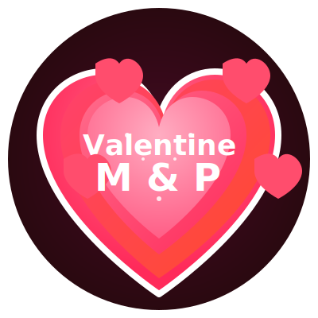
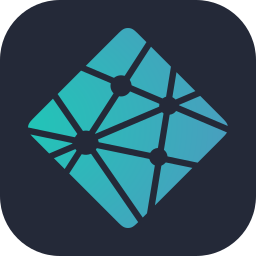

# 💘 Romantic Valentine's Day Website 💘

  
  
  
  
  
  
A beautifully crafted, interactive Valentine's Day experience created with love.

  
  
  
  
  
  
  

## 💝 About This Project

This Valentine's Day website is a heartfelt expression of love created specially for my amazing girlfriend. It combines elegant design with interactive elements to create an unforgettable romantic experience that's as unique as our relationship.

> _"Love is not just looking at each other, it's looking in the same direction."_ — Antoine de Saint-Exupéry

## ✨ Features & Enhancements

This website creates a memorable Valentine's Day experience with:

### Design

- **🌙 Romantic Theme:** Dark burgundy theme with pink and red accents
- **💖 Animations:** Floating hearts and dynamic GIFs that change with interactions
- **✨ Modern UI:** Glass-morphism design with elegant shadows and celebration effects
- **🎨 Custom Logo:** Animated SVG with pulsing hearts and personalized initials

### Interactive Elements

- **💬 Dynamic Messages:** Changing romantic texts that respond to user interactions
- **🔄 Playful Buttons:** Buttons that change size and position as interaction progresses
- **👆 Responsive Effects:** Elements with subtle animations and glowing hover states

### Accessibility

- **📱 Responsive Design:** Adapts to all device sizes from mobile to desktop
- **🌈 High Contrast:** Carefully selected colors for optimal readability
- **⚡ Performance:** Optimized animations that work smoothly across devices

## 💕 How It Works

The website presents a Valentine's proposal with two options: "Yes" and "No". As you might guess, selecting "No" isn't really an option! Each time "No" is clicked, the button gets smaller while the "Yes" button grows larger. Meanwhile, romantic messages change to express increasingly heartfelt pleas.

When "Yes" is finally selected, a celebration animation begins with floating hearts and a sweet confirmation message.

## 🛠️ Technologies Used

  
  
  
  
  

## 💌 A Personal Note

Happy Valentine's Day, my love! I've poured my heart into creating this website just for you. Every color, animation, and word was chosen with care to express how deeply I feel for you. You make every day special, and I hope this small token of my affection brings a smile to your face.

With all my love and devotion,
Miguel

---

  
© 2025 Made with ❤️ by Miguel

